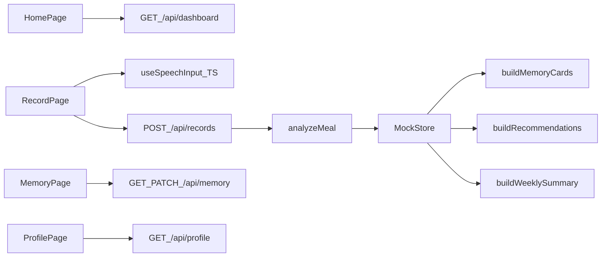

# 吃了么 V1 Mock 架构

## 目录结构

- `app/`：页面与 API 路由
- `components/`：首页、记录、记忆、我的页面组件
- `lib/types/`：核心领域类型
- `lib/domain/`：分析、记忆、推荐、总结逻辑
- `lib/mock/`：种子数据与运行时 store
- `lib/voice/`：TypeScript 语音输入 hook

## 当前数据流

## 模块职责

### 页面层

- `app/page.tsx`：首页，展示时段卡片、推荐、最近记忆、最近记录
- `app/record/page.tsx`：记录页，支持文本和语音输入
- `app/memory/page.tsx`：记忆页，支持查看和修正记忆
- `app/profile/page.tsx`：我的页，展示历史和周总结

### API 层

- `/api/dashboard`：首页聚合数据
- `/api/records`：提交记录并返回分析结果
- `/api/memory`：读取/修正记忆
- `/api/profile`：读取历史和总结

### 领域层

- `analyze.ts`：从自然语言提取结构化字段并生成轻反馈
- `memory.ts`：从记录聚合成可读记忆卡片
- `recommend.ts`：基于最近状态生成可解释推荐
- `summary.ts`：生成每周总结

## 一致性说明

- 同一份 `records` 既用于首页推荐，也用于记忆和周总结，保证前后逻辑一致。
- 用户在记忆页修正后，首页再次取数时会反映最新记忆。
- 记录、记忆、推荐都使用统一的 TypeScript 类型，便于后续替换成真实服务。
